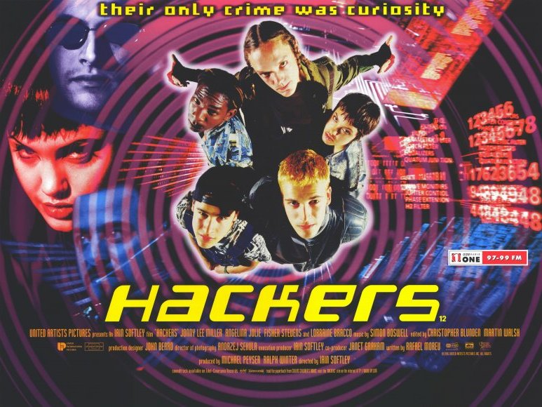
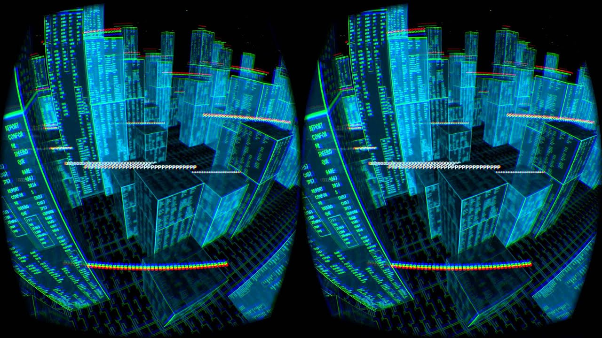
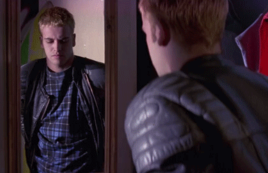

# Chartbeat Hackweek 31 -- Project Gibson


Archive of Code from 2015 Hackweek @ [Chartbeat](https://github.com/chartbeat)

Updated to use more recent versions of Node and deps since all the ones I used
originally have been deprecated. Fair warning: I am not a Javascript Developer!

```bash
./scripts/run.sh
```

## Blog Post

[Original Blog Post](https://engineering.chartbeat.com/2015/11/25/hackweek-31/)

Here's a little known fact about AWS Redshift: it was previously known as the
"Gibson" project at the Ellingson Mineral Company [before that whole Hack the
Planet / DaVinci virus scandal drove the company into the ground in
1995][hackers-wikipedia]. Amazon acquired rights to the project in subsequent
years and turned it into the data warehouse we know and love. To the
disappointment of programmers everywhere, the product managers at Amazon decided
somewhere along the way it would cut costs and ease adoption to remove the
[original graphical interface][gibson-gui] to the database and replace it with
the Postgres-compatable one we have today.

Okay, not really. The Gibson was the supercomputer featured in the 1995 teen
sci-fi thriller, and now cult-classic, Hackers. The movie energetically explored
and sensationalized the early Hacker subculture and effectively inspired a whole
generation of kids to become computer programmers. Myself (Paul Kiernan) and two
other initiates of the hackerverse (Matt Owen and Anastasis Germanidis) came
together over the past hackweek at Chartbeat to make the original Gibson
interface a reality and perhaps even bring it to the Oculus Rift.



We began by investigating the Oculus Rift SDK and frameworks we could use to
include an [existing C++ project][existing-project] that emulated the Gibson
interface. Unfortunately, it quickly became clear we would be unlikely to
produce anything in a reasonable amount of time if we had to struggle with the
[lack of support for the SDK on OS X][no-osx-sdk], learn how to use
[openframeworks][openframeworks], and refactor the existing project to include
Redshift adapters and work generally with VR in c++. So we researched
alternative platforms and settled on the widely accessible combination of
[WebVR][webvr] and [threejs][threejs].

WebVR is an experimental Javascript API that provides access to Virtual Reality
devices like the Oculus Rift. Combined with threejs, a wonderful javascript
framework around WebGL, we were able to create a Gibson-like interface to one of
our Redshift clusters that runs entirely in the browser. The final product
queries our cluster to get a list of tables and their sizes and paints them as
buildings on a 3D landscape. Buildings are arranged randomly on a plane and
their heights are a function of the number of rows in a table they represent.

Here you can see two videos of the gibson interface hooked up to one of our
production Redshift databases (with table names obfuscated for, you know,
security reasons).


#### 2D Gibson:
[](https://youtu.be/t5PbktJ8YBU)

#### 3D Gibson (via Oculus):
[](https://youtu.be/UCUC2aIroJI)

The Gibson project can be hooked up to any Redshift cluster or general postgres
database so let us know if you’d be interested in playing around with it!

Hack the planet!




[hackers-wikipedia]: https://en.wikipedia.org/wiki/Hackers_(film)
[gibson-gui]: https://www.youtube.com/watch?v=vYNnPx8fZBs&feature=youtu.be&t=23s
[existing-project]: https://github.com/paulkiernan/hack-the-gibson
[no-osx-sdk]: http://www.dailytech.com/Oculus+Rift+Confirms+Pause+in+OS+X+Linux+Development+Some+Devs+are+Mad/article37354.htm
[openframeworks]: http://openframeworks.cc/
[webvr]: http://webvr.info/
[threejs]: http://threejs.org/
